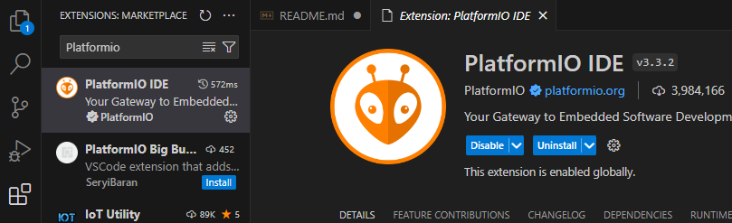
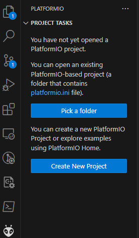
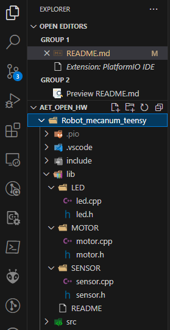
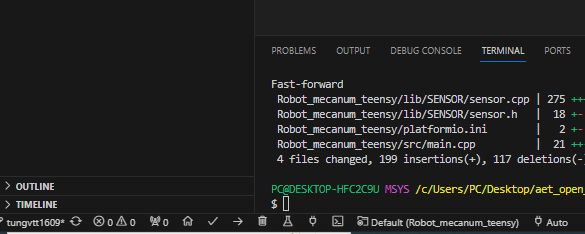
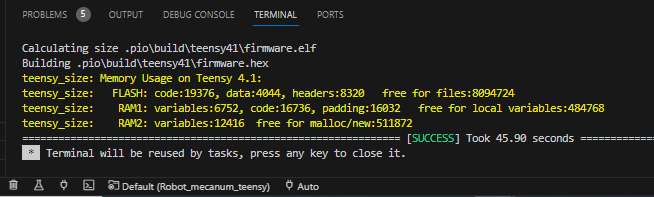

# ate_open_hw
## Hardware:
- Teensy 4.1 or Mega 2560
- Step Motor
- Sonar
- Led
## Software:
- Arduino platformio and C++
## Feature:
- Control 4-wheel mecanum
- Read sensor and publisher for Jetson
- Control step motor and subscriber for Jetson
## Programs and Build firmware for Teensy:
1. Install platformio on vscode

2. Create project with platformio

3. Create libs: sensor, motor, led.

4. Note: implement the publisher and subcriber in main.cpp. Don't do not this in the main of libs.  
5. Click (v) for building code. 

6. Results:

## Note before uploading code for teensy:
- On ubuntu, pls install udev teensy.rules with link: https://www.pjrc.com/teensy/00-teensy.rules
- Run terminal: sudo cp 00-teensy.rules /etc/udev/rules.d/
- Run terminal: tar -xvzf teensy_linux64.tar.gz
- Run terminal: ./teensy &

## Debug with teensy:
- Fail (circuit error and fixing).
- Replace Mega and debug: install and build ros_lib before running. With link: http://wiki.ros.org/rosserial_arduino/Tutorials/Arduino%20IDE%20Setup

